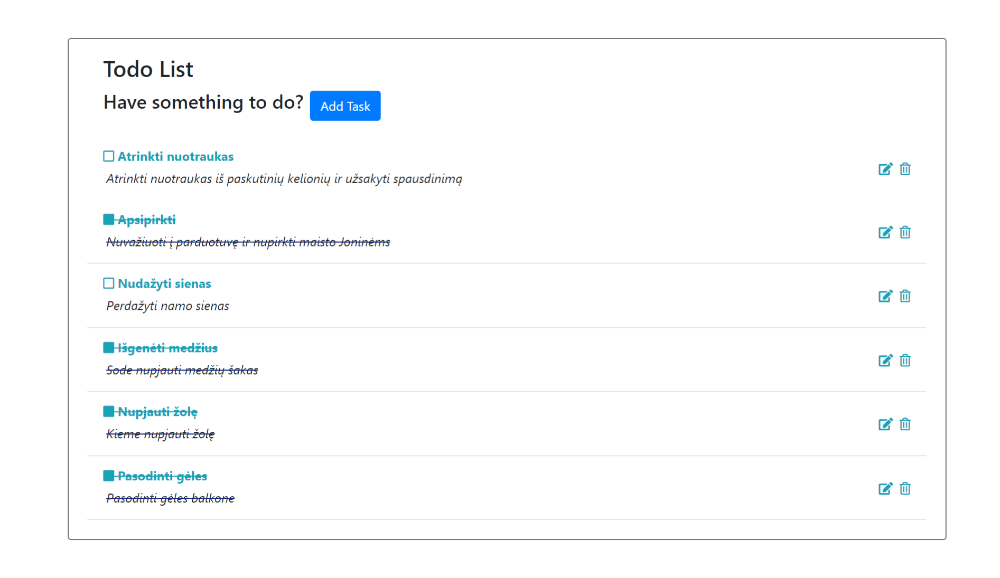
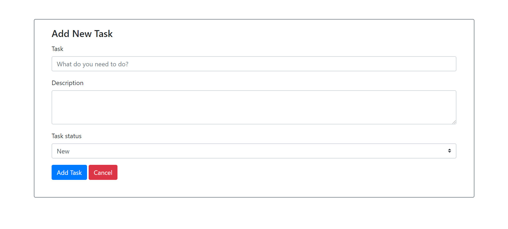

# To Do app
An app for to do list. Build on Laravel 7.

## General info
This is a training project to learn Laravel.
The task was to create the to do app with ability to add new task, edit task, change its status and delete it.

## Technologies
Project is created with:
* Bootstrap 4
* Laravel 7

## Illustrations
The main page with all tasks


Add new task window


## Set up instructions
1. To run this app you need to have a PHP, Composer, MySQL database and Valet.
2. Clone this repo and navigate into the folder
```
git clone https://github.com/aistyska/todo_laravel.git
```
3. Install all the dependencies
```
composer install
```
4. Link this project to valet
```
valet link
```
5. Create environment file
```
cp .env.example .env
php artisan key:generate
```
6. Inside .env file update DB_DATABASE, DB_USERNAME, DB_PASSWORD parameters to your local database connection.
7. Run migrations
```
php artisan migrate
```
8. That's it! You should be able to access the web through todo_laravel.test
